# Claude Code 使用说明

## 基础操作

### Shift + Tab 切换模式


### 给claude code最大的权限


### /tasks 查看后台任务

### /rewind 进行任务回滚（或者按两下esc）

### claude -c 打开claude并自动恢复到上次对话

### /compact 进行上下文压缩（ctrl + O 可以看到压缩后的上下文，再按ctrl + O 返回）

### /clear 清空所有的上下文

### /init 自动生成一个CLAUDE.md文件

### /memory 管理项目特定的持久化上下文信息

### claude update 更新claude

### /hooks 在 Claude Code 执行特定操作时自动运行自定义脚本

### /model 切换模型

### /agengts

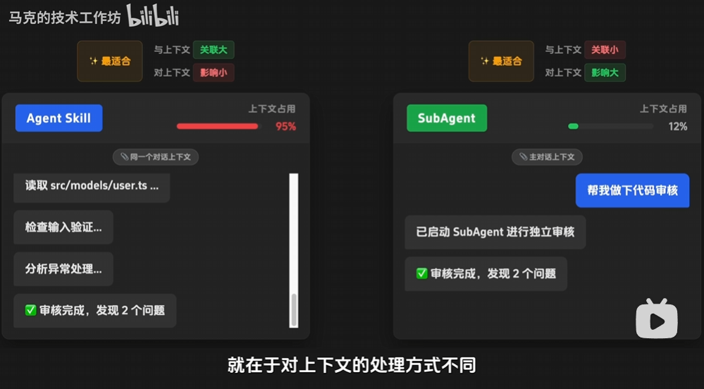

### /plugins 管理claude code插件

## 虚拟环境使用

### 无需激活虚拟环境即可使用 Claude Code

**重要提示：** 你可以直接进入项目目录使用 Claude Code，无需先激活虚拟环境！

#### 当前项目配置

- **虚拟环境路径**: `.venv/`
- **Python 版本**: 3.13.0
- **Python 可执行文件**: `.venv/Scripts/python.exe` (Windows)

#### 推荐工作流程

```bash
# 1. 直接进入项目目录
cd D:\codes\study\python

# 2. 启动 Claude Code（无需激活虚拟环境）
claude

# 3. Claude Code 会自动使用虚拟环境中的 Python
```

#### Claude Code 如何使用虚拟环境

Claude Code 会通过以下方式自动使用你的虚拟环境：

**方法 1：使用完整路径**

```bash
.venv/Scripts/python.exe -m pip install requests
.venv/Scripts/python.exe main.py
```

**方法 2：临时激活（如果需要）**

```bash
.venv/Scripts/activate && python main.py
```

#### 常用命令示例

```bash
# 安装包
.venv/Scripts/python.exe -m pip install <package>

# 查看已安装的包
.venv/Scripts/python.exe -m pip list

# 运行脚本
.venv/Scripts/python.exe main.py

# 运行 FastAPI 应用
.venv/Scripts/python.exe -m uvicorn main:app --reload
```

#### 为什么不需要激活？

- Claude Code 可以直接调用虚拟环境中的 Python 解释器
- 所有依赖包都会从 `.venv/` 中加载
- 避免了手动激活/停用的繁琐步骤
- 更适合自动化和脚本执行

## 配置文件说明

### `.claude/` 配置文件 vs CLAUDE.md

Claude Code 使用两种不同的配置机制，它们各司其职、相互配合：

#### 一、`.claude/` 配置文件

**性质：** 系统配置文件（JSON 格式）

**作用：** 控制 Claude Code 的**行为和权限**

**配置文件层级：**

1. **全局设置** (`~/.config/claude/settings.json`): 适用于所有项目
2. **项目设置** (`.claude/settings.json`): 项目级设置，通常提交到 git
3. **本地设置** (`.claude/settings.local.json`): 本地覆盖设置，不提交到 git

**常见配置内容：**

- 权限设置（允许/禁止哪些操作）
- MCP 服务器配置
- 自定义技能/命令
- 钩子（hooks）配置
- 模型偏好设置

**示例配置：**

```json
{
  "permissions": {
    "allow": ["Bash(python:*)"],
    "deny": ["Bash(rm:*)"]
  },
  "mcpServers": {
    "myserver": {
      "command": "node",
      "args": ["server.js"]
    }
  }
}
```

#### 二、CLAUDE.md 文件

**性质：** 项目文档文件（Markdown 格式）

**作用：** 为 Claude 提供**项目上下文和知识**

**应包含内容：**

1. **项目概述** - 项目功能、技术栈、架构
2. **代码库结构** - 目录组织、关键文件
3. **开发指南** - 编码规范、测试实践
4. **重要上下文** - 设计决策、已知问题
5. **常见任务** - 运行、测试、部署流程

**示例内容：**

```markdown
# 项目说明

这是一个 FastAPI 项目...

## 目录结构

- `my_fastApi/`: 主应用目录
- `main.py`: 应用入口

## 编码规范

- 使用 Python 3.10+
- 遵循 PEP 8 规范
```

#### 三、区别与联系

**形象比喻：**

- **`.claude/` 配置** = Claude Code 的"操作手册"（告诉它能做什么、怎么做）
- **CLAUDE.md** = 你项目的"说明书"（告诉它你的项目是什么、如何理解）

**对比表格：**

| 方面         | `.claude/` 配置                                | CLAUDE.md              |
| ------------ | ---------------------------------------------- | ---------------------- |
| **控制行为** | ✅ 控制能执行什么操作                          | ❌ 不控制行为          |
| **提供知识** | ❌ 不提供项目知识                              | ✅ 提供项目上下文      |
| **格式**     | JSON（机器可读）                               | Markdown（人类可读）   |
| **读取时机** | 每次工具调用时检查                             | 对话开始时读取         |
| **影响范围** | 技术层面（权限、工具）                         | 认知层面（理解、决策） |
| **版本控制** | settings.json 提交，settings.local.json 不提交 | 通常提交到 git         |

**配合使用示例：**

1. **允许 Python 命令执行**
   - `.claude/settings.local.json`: 配置 `"allow": ["Bash(python:*)"]`
   - CLAUDE.md: 说明"本项目使用 Python 3.10，虚拟环境在 venv/ 目录"

2. **代码风格控制**
   - `.claude/` 配置: 配置 hooks 在提交前运行 linter
   - CLAUDE.md: 描述"我们使用 Black 格式化，行长度 88 字符"

3. **数据库操作**
   - `.claude/` 配置: 设置权限允许读取 `.env` 文件
   - CLAUDE.md: 说明"数据库配置在 .env 中，使用 SQLAlchemy ORM"

**总结：**

- **`.claude/` 配置** 告诉 Claude Code **"你能做什么"**（权限和能力）
- **CLAUDE.md** 告诉 Claude Code **"你应该知道什么"**（项目知识和上下文）

两者结合使用，让 Claude Code 既有正确的权限执行操作，又有足够的上下文做出明智的决策。

# Agent Skills 从使用到原理

## 什么是Agent Skill？模型使用的一个说明文档。（简化解释）

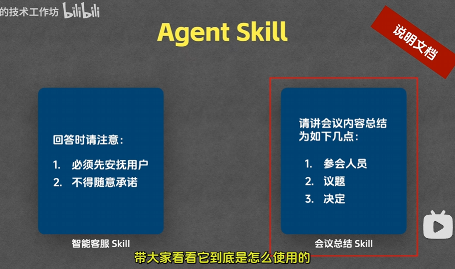
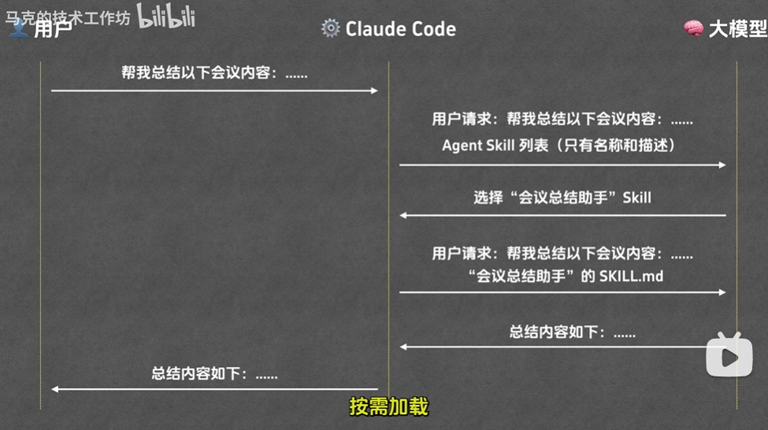
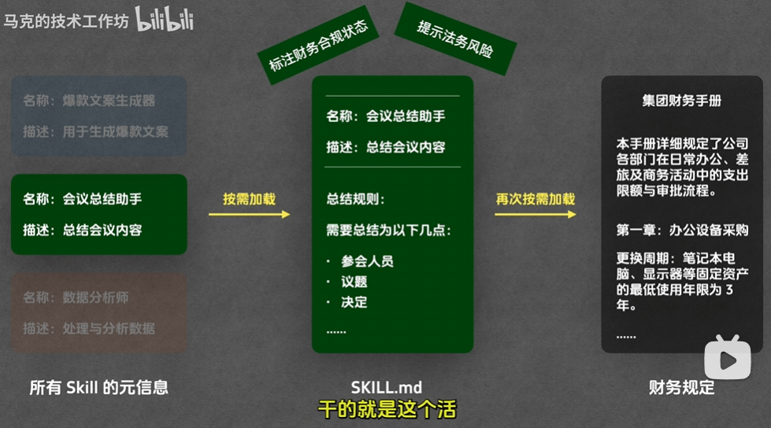

### Agent Skill中引入的脚本文件之后被执行，不会引入上下文占用token

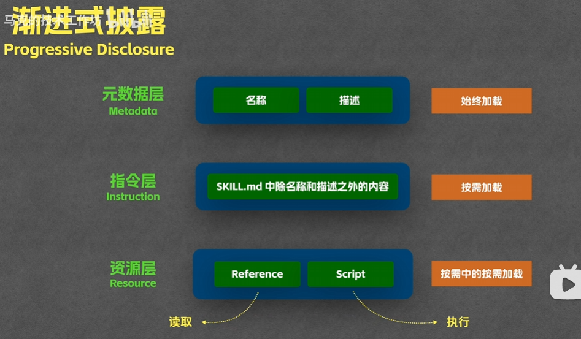
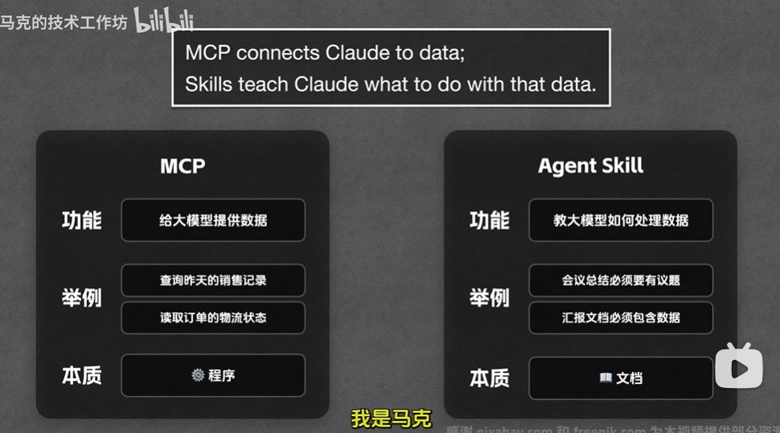

# Agent Skills (Claude Skills) 详细攻略

## 项目生效

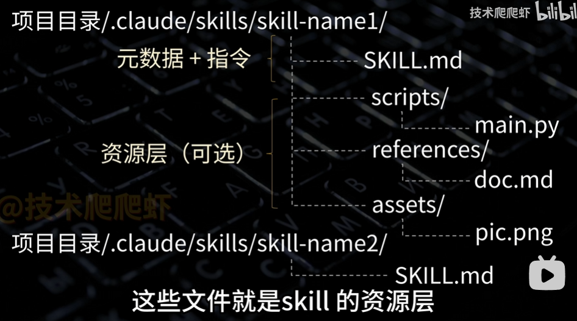

## 全局生效:

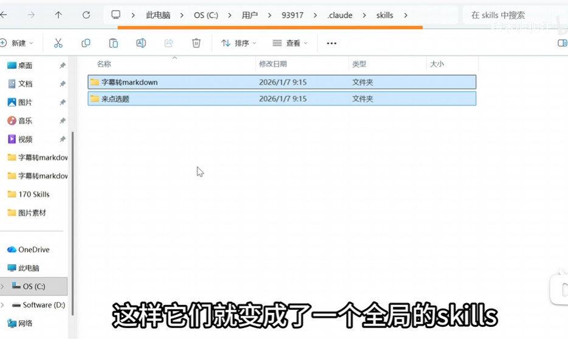

## 好用的skills

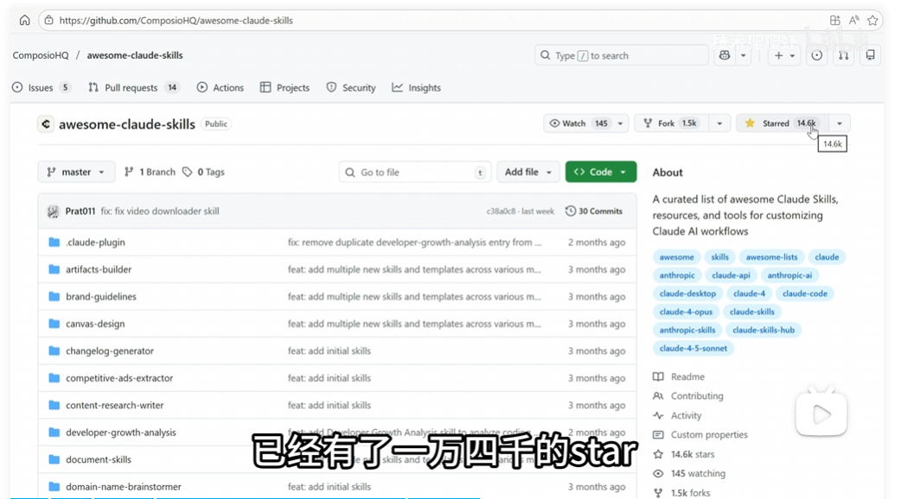

## 进阶

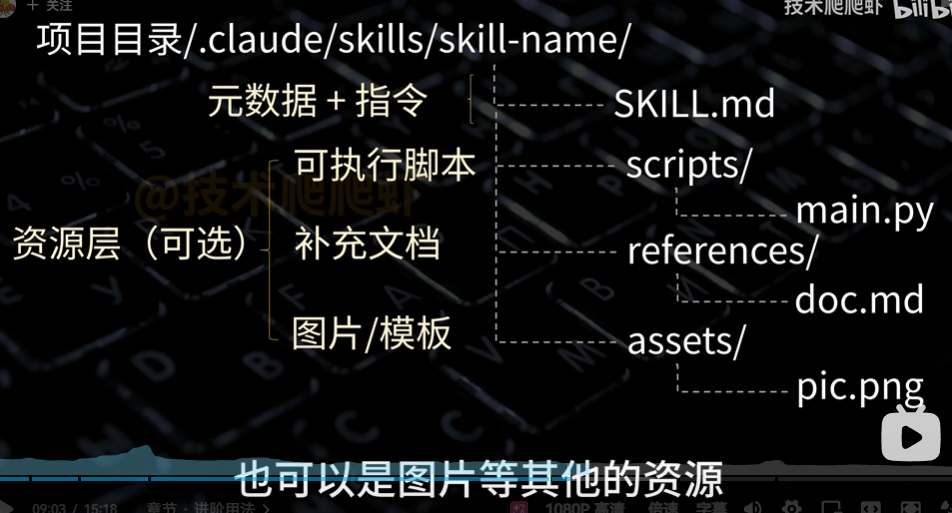

<br>
# 名称解释

## LLM（Large Language Model，大语言模型）

经过海量文本数据训练的人工智能模型，能够理解和生成自然语言。它通过学习文本中的统计规律来预测下一个词，从而实现对话、写作、编程等能力。

**常见的 LLM：**

- Claude（Anthropic）— Claude Code 背后的模型
- GPT（OpenAI）
- Gemini（Google）
- DeepSeek

**形象比喻：** LLM 就像一个读过海量书籍的"超级大脑"，虽然它不能真正"理解"，但能基于学到的模式生成高质量的回答。

---

## Context（上下文）

Claude 在一次对话中能"看到"的所有信息的总和，包括：

- **系统提示**：CLAUDE.md 中的项目说明
- **对话历史**：你和 Claude 之前的所有对话内容
- **文件内容**：Claude 读取过的代码和文档
- **工具结果**：执行命令、搜索等操作的返回结果

**上下文窗口（Context Window）：** LLM 一次能处理的最大信息量，超出后早期信息会被"遗忘"。这就是为什么需要 `/compact` 来压缩上下文。

**形象比喻：** 上下文就像 Claude 的"工作台"，台面大小有限（上下文窗口），放不下时就需要整理（压缩）。

---

## Prompt（提示词）

你发送给 LLM 的输入文本，用于引导模型生成期望的输出。Prompt 的质量直接影响回答的质量。

**Prompt 的类型：**

- **System Prompt（系统提示）**：预设的指令，定义 Claude 的行为方式（如 CLAUDE.md）
- **User Prompt（用户提示）**：你在对话中输入的问题或指令
- **Few-shot Prompt**：在提示中给出几个示例，引导模型按特定格式回答

**示例：**

```
# 差的 Prompt
"写个函数"

# 好的 Prompt
"用 Python 写一个异步函数，接收用户 ID 参数，从 MySQL 数据库查询用户信息并返回 Pydantic 模型"
```

**形象比喻：** Prompt 就像你给员工下达的"工作指令"，指令越清晰具体，结果越好。

---

## Memory（记忆）

Claude Code 中通过 `/memory` 命令管理的**持久化上下文信息**。与普通上下文不同，Memory 会跨会话保存，每次启动 Claude Code 时自动加载。

**特点：**

- 存储在项目本地
- 跨会话持久化（关闭再打开仍然存在）
- 对话开始时自动加载
- 可随时通过 `/memory` 编辑

**适合存储的内容：**

- 项目编码规范："所有函数必须使用类型注解"
- 技术约束："数据库操作必须使用异步"
- 个人偏好："回答请使用中文"

**形象比喻：** Memory 是 Claude 的"笔记本"，记录了需要长期记住的重要事项。而普通上下文是"白板"，会话结束就擦掉了。

---

## Agent（智能体）

一个能够**自主决策、调用工具、完成复杂任务**的 AI 系统。与普通的 LLM 对话不同，Agent 不仅能"说"，还能"做"。

**Agent 的核心能力：**

1. **感知**：读取文件、搜索代码、获取信息
2. **决策**：根据当前情况判断下一步该做什么
3. **行动**：执行命令、编辑文件、调用 API
4. **反馈**：根据执行结果调整策略

**Claude Code 就是一个 Agent：**

```
你说："帮我修复这个 bug"
    ↓
Claude（Agent）自主决策：
  1. 先读取相关代码 → 调用 Read 工具
  2. 搜索错误来源 → 调用 Grep 工具
  3. 分析问题原因 → LLM 推理
  4. 修改代码 → 调用 Edit 工具
  5. 验证修复 → 调用 Bash 运行测试
```

**形象比喻：** LLM 是"大脑"，Agent 是"有手有脚的大脑"——不仅能思考，还能行动。

---

## RAG（Retrieval-Augmented Generation，检索增强生成）

一种让 LLM 在回答问题前，先从外部知识库中**检索相关信息**，然后基于检索到的内容生成回答的技术。

**工作流程：**

```
用户提问
    ↓
① 检索（Retrieval）：从知识库中搜索相关文档
    ↓
② 增强（Augmented）：将检索到的文档作为上下文
    ↓
③ 生成（Generation）：LLM 基于检索内容生成回答
```

**为什么需要 RAG？**

- LLM 的训练数据有截止日期，无法知道最新信息
- LLM 不了解你的私有数据（公司文档、项目代码等）
- RAG 让 LLM 能够基于**实时、准确的数据**回答问题

**Claude Code 中的 RAG 体现：**

- Claude 读取你的代码文件 → 检索
- 基于代码内容回答问题 → 增强生成
- CLAUDE.md 提供项目知识 → 知识库

**形象比喻：** 普通 LLM 像"闭卷考试"（只靠记忆），RAG 像"开卷考试"（可以翻书查资料）。

---

## Web Search（联网搜索）

让 LLM 能够**实时搜索互联网**获取最新信息的能力。弥补了 LLM 训练数据有截止日期的局限。

**在 Claude Code 中：**

- Claude Code 内置了 `WebFetch` 和 `WebSearch` 工具
- 可以搜索最新的文档、API 参考、错误解决方案
- 当 Claude 的训练数据中没有相关信息时会自动使用

**示例：**

```
你："FastAPI 0.128.0 有什么新特性？"
Claude → 调用 WebSearch 搜索最新文档 → 基于搜索结果回答
```

**与 RAG 的区别：**

- RAG：从**私有知识库**检索（如你的代码、文档）
- Web Search：从**公开互联网**搜索（如 Google、文档网站）

---

## Function Calling（函数调用）

LLM 能够**识别用户意图并调用预定义函数**的能力。LLM 本身不执行函数，而是生成函数调用的参数，由外部系统执行。

**工作流程：**

```
用户："查询 ID 为 42 的用户"
    ↓
LLM 判断需要调用函数，生成：
  {
    "function": "query_user",
    "parameters": { "user_id": 42 }
  }
    ↓
外部系统执行函数，返回结果
    ↓
LLM 基于结果生成自然语言回答：
  "ID 为 42 的用户是张三，邮箱是 zhangsan@example.com"
```

**在 Claude Code 中的体现：**
Claude Code 的所有工具调用本质上都是 Function Calling：

- `Read("main.py")` — 调用读取文件函数
- `Bash("git status")` — 调用命令执行函数
- `Grep("pattern")` — 调用搜索函数
- `Edit("file", old, new)` — 调用编辑函数

**形象比喻：** Function Calling 让 LLM 从"只会说话"变成"能操作工具"。就像你告诉助手"帮我查一下快递"，助手知道要打开快递 APP 并输入单号。

---

## MCP（Model Context Protocol，模型上下文协议）

Anthropic 创建的**开放协议**，标准化 AI 应用连接外部工具和数据源的方式。

**架构：**

```
Claude Code  ◄──MCP协议──►  MCP Server  ◄──►  外部资源
(客户端)                     (中间件)          (数据库/API等)
```

**核心概念：**

- **MCP Client**：Claude Code 本身，发送请求
- **MCP Server**：独立运行的中间件程序，连接外部系统
- **Tools/Resources/Prompts**：MCP Server 暴露给 Claude 的能力

**配置方式（在 `.claude/settings.json` 中）：**

```json
{
  "mcpServers": {
    "github": {
      "command": "npx",
      "args": ["-y", "@modelcontextprotocol/server-github"],
      "env": { "GITHUB_TOKEN": "your-token" }
    }
  }
}
```

**常见 MCP Server：**

- `server-github`：GitHub 操作（Issue、PR）
- `server-postgres`：PostgreSQL 数据库查询
- `server-puppeteer`：浏览器自动化
- `server-slack`：Slack 集成

**与 Function Calling 的关系：**

- Function Calling 是 LLM 的**能力**（能调用函数）
- MCP 是**协议**（标准化如何连接外部工具）
- MCP Server 通过 Function Calling 的方式被 Claude 调用

**形象比喻：** MCP 就像 Claude Code 的"USB 接口标准"，任何符合标准的设备（MCP Server）都能即插即用。

---

## LangChain

一个流行的**开源框架**，用于构建基于 LLM 的应用程序。它提供了一套标准化的组件和工具链，简化 LLM 应用的开发。

**核心组件：**

- **Chains（链）**：将多个 LLM 调用串联起来
- **Agents（代理）**：让 LLM 自主决策调用哪些工具
- **Memory（记忆）**：管理对话历史
- **Retrievers（检索器）**：实现 RAG 功能

**与 Claude Code 的关系：**

- LangChain 是一个**通用框架**，可以对接多种 LLM（包括 Claude）
- Claude Code 是 Anthropic 的**专用工具**，专门为 Claude 模型优化
- 两者解决类似问题（构建 AI 应用），但方式不同

**形象比喻：** LangChain 像"万能工具箱"（支持各种 LLM），Claude Code 像"专用工具套装"（专为 Claude 打造）。

---

## Workflow（工作流）

将多个步骤按照**预定义的顺序**串联起来，形成一个自动化的任务流程。与 Agent 的自主决策不同，Workflow 的执行路径是**确定的**。

**Workflow vs Agent：**

```
Workflow（确定性）：
  步骤1 → 步骤2 → 步骤3 → 完成
  （每一步都是预定义的，不会变）

Agent（自主性）：
  步骤1 → 根据结果判断 → 可能走步骤2a 或 2b → 继续判断...
  （根据情况动态决策）
```

**在 Claude Code 中的体现：**

- **Hooks** 是一种简单的 Workflow：pre-commit → 格式化代码 → 提交
- **Agent Skills** 也包含 Workflow 元素：按预定义步骤执行任务
- **Claude 本身是 Agent**：能自主决策，不局限于固定流程

**形象比喻：** Workflow 像"流水线"（固定流程），Agent 像"项目经理"（灵活决策）。

---

## Agent Skill（代理技能）

Claude Code 中预定义的**指令文档**，通过斜杠命令（如 `/review`、`/init`）触发。本质上是一份告诉 Claude "该做什么、怎么做"的任务说明书。

**工作原理：**

```
用户输入 /review
    ↓
Claude 加载 review 的指令文档
    ↓
按指令自主调用工具执行多步任务
    ↓
输出结构化结果
```

**可用的 Agent Skills：**
| 命令 | 功能 |
|------|------|
| `/init` | 生成 CLAUDE.md 项目文档 |
| `/review` | 审查 Pull Request |
| `/security-review` | 安全审查 |
| `/pr-comments` | 获取 PR 评论 |
| `/debug` | 调试会话 |
| `/insights` | 使用情况报告 |

**特点：** Skill 中引入的脚本文件被执行后不会引入上下文占用 token。

**形象比喻：** Agent Skill 就像给 Claude 一份"标准作业流程（SOP）"，它按照 SOP 自主完成任务。

---

## SubAgent（子代理）

Claude Code 通过 `Task` 工具启动的**独立代理实例**，用于自主处理复杂的多步骤任务。主 Claude 将任务委派给 SubAgent，SubAgent 独立执行后返回结果。

**工作原理：**

```
主 Claude Code
    ↓ 委派任务
    └─→ SubAgent（独立运行）
        ├─ 第 1 轮：搜索分析
        ├─ 第 2 轮：细化结果
        └─ 返回综合结果
    ↓
主 Claude 整合结果
```

**6 种 SubAgent 类型：**
| 类型 | 用途 |
|------|------|
| `Bash` | 命令执行（git、npm 等） |
| `general-purpose` | 通用多步骤任务 |
| `Explore` | 快速探索代码库 |
| `Plan` | 设计实现方案 |
| `claude-code-guide` | Claude Code 文档查询 |
| `statusline-setup` | 配置状态栏 |

**与 Agent Skill 的区别：**

- **Agent Skill**：预定义的快捷操作，像"按按钮" → 快速、可预测
- **SubAgent**：动态的独立代理，像"派专家" → 灵活、深度探索


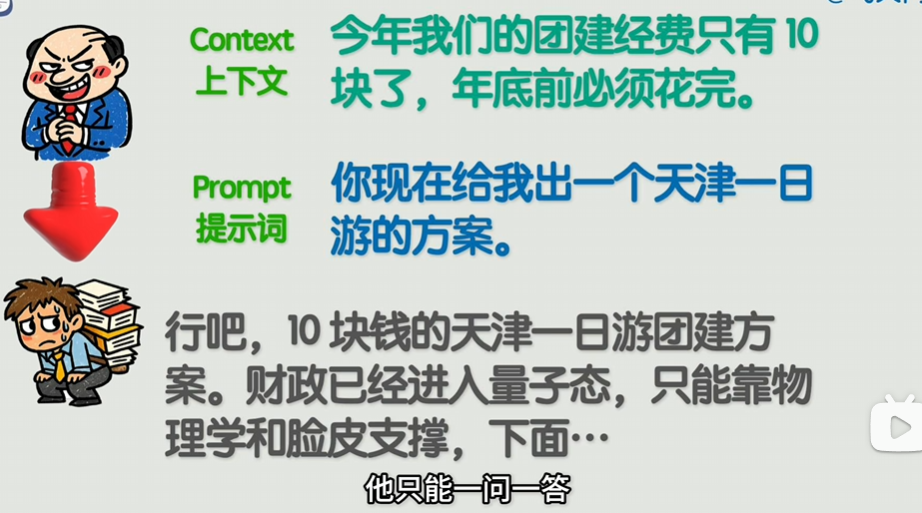
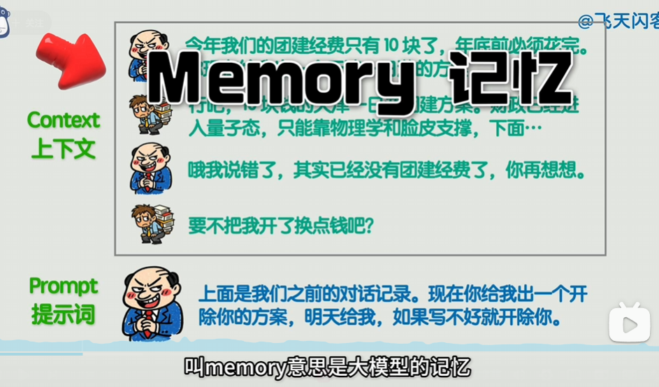

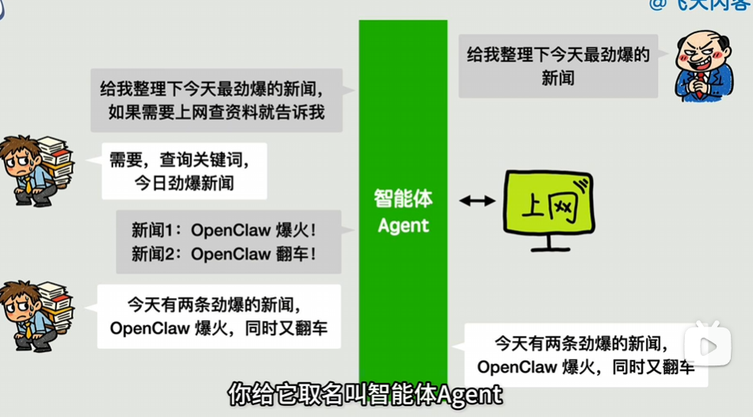
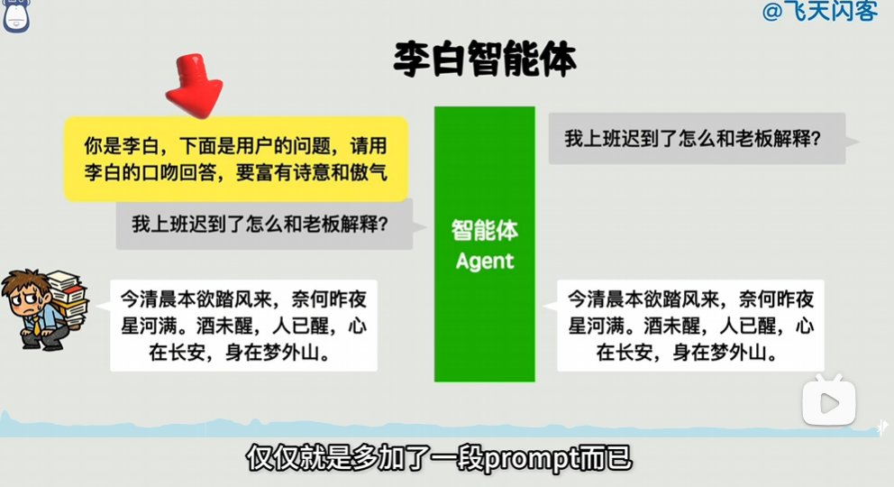
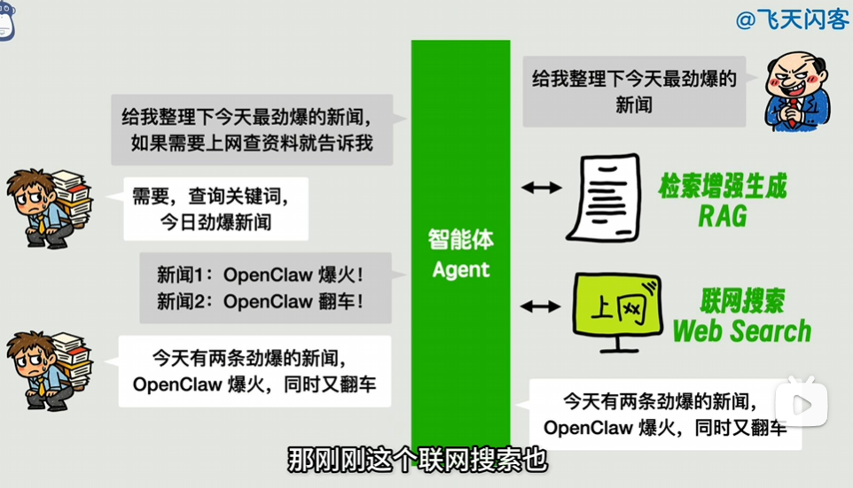
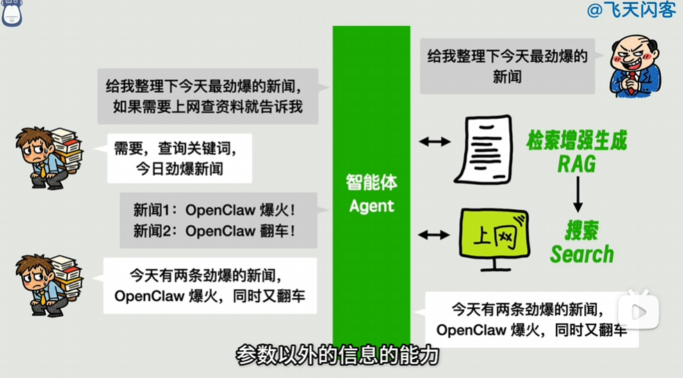
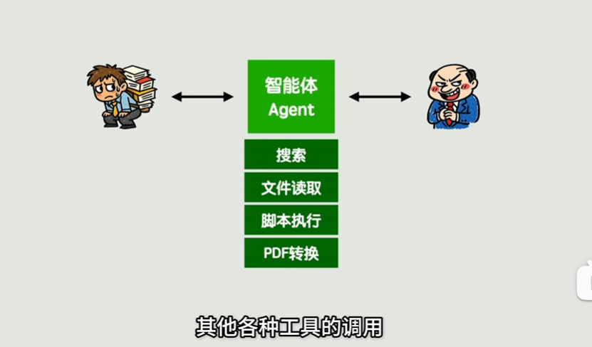
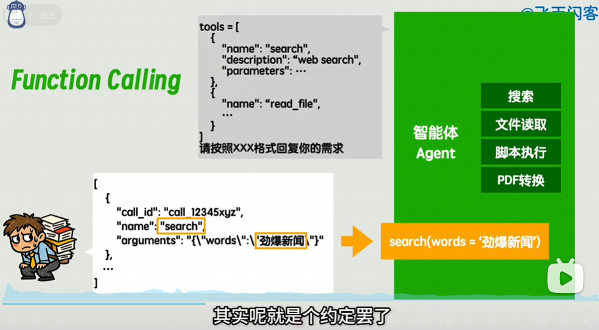
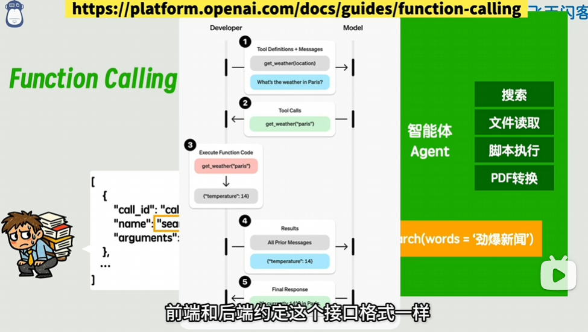
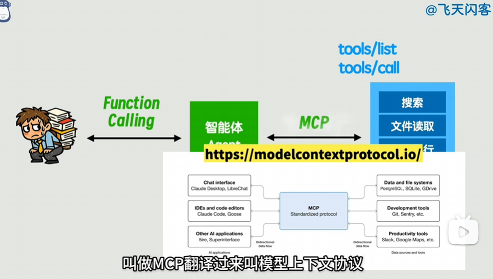
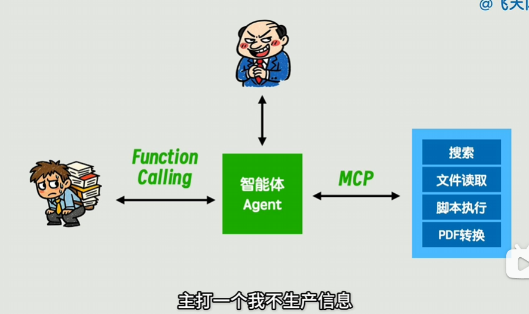
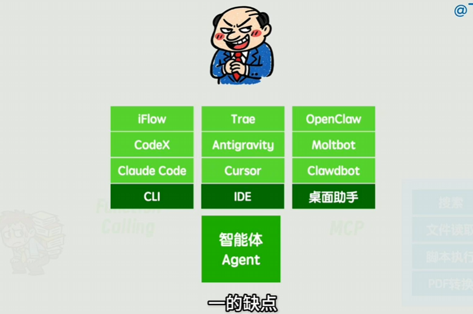

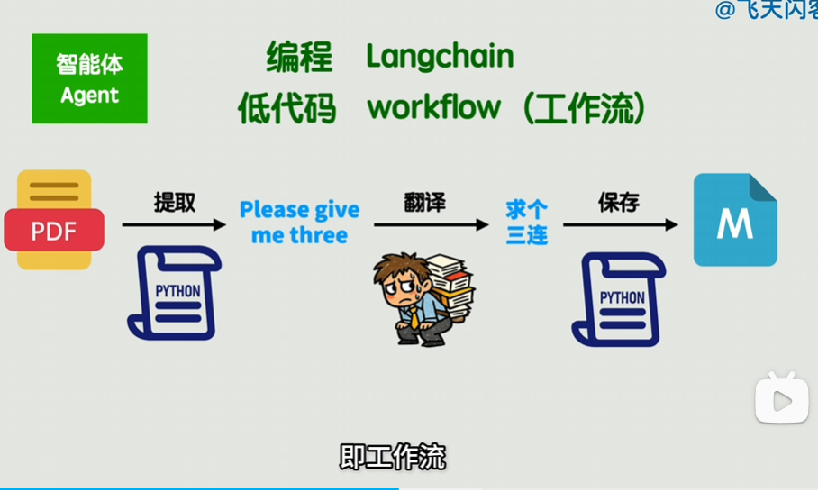
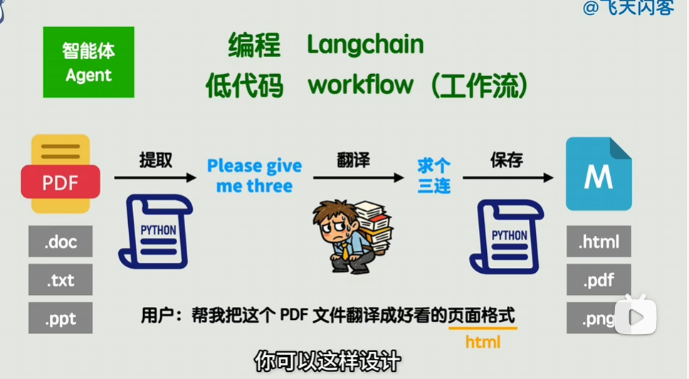

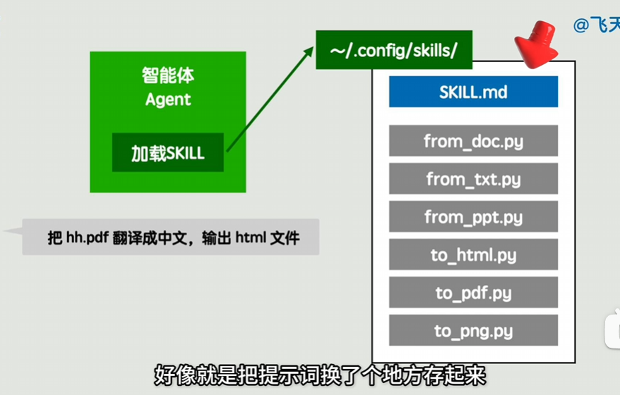

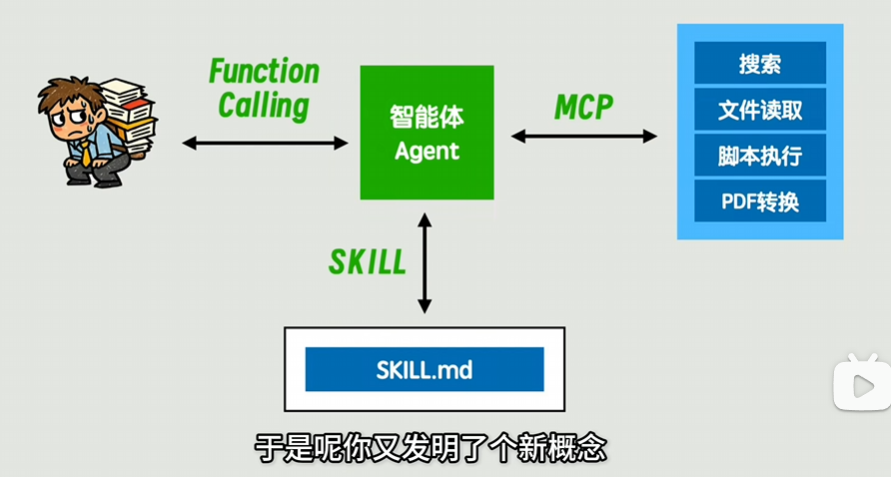
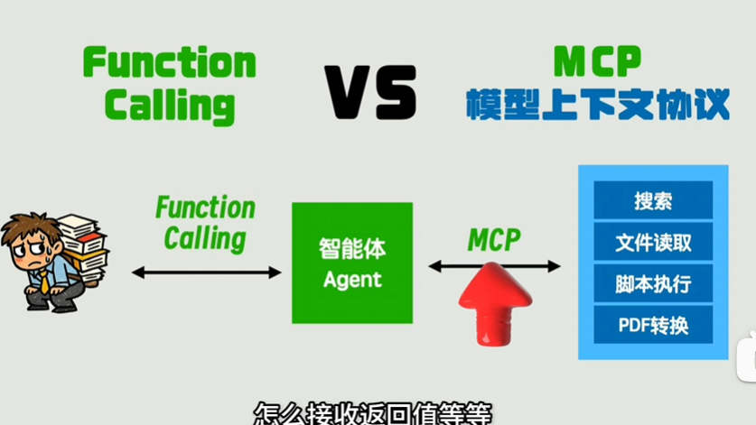
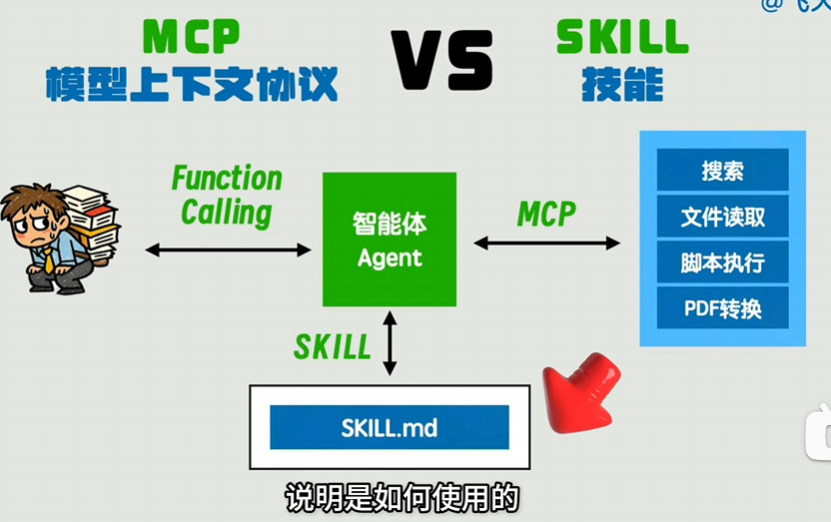
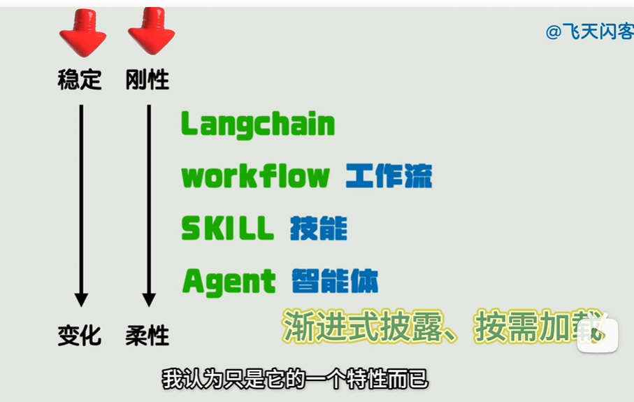
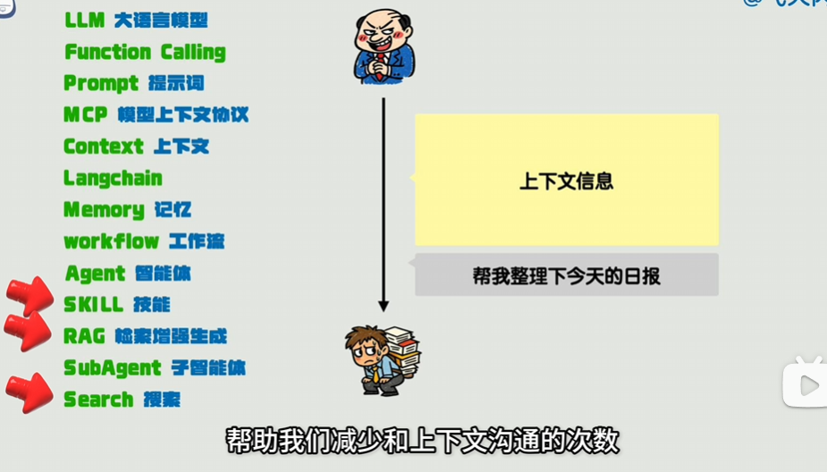
<br>
<br>
<br>

# 文档视频资源连接

[Claude Code 从 0 到 1 全攻略](https://www.bilibili.com/video/BV14rzQB9EJj/?spm_id_from=333.1387.homepage.video_card.click&vd_source=826104bbac0c4b5621e84e9903e39e05)

[Agent Skill 从使用到原理](https://www.bilibili.com/video/BV1cGigBQE6n/?spm_id_from=333.1387.homepage.video_card.click&vd_source=826104bbac0c4b5621e84e9903e39e05)

[一口气拆穿Skill/MCP/RAG/Agent/OpenClaw底层逻辑](https://www.bilibili.com/video/BV1ojfDBSEPv?spm_id_from=333.788.recommend_more_video.1&trackid=web_related_0.router-related-2481894-52kq4.1770690722202.810&vd_source=826104bbac0c4b5621e84e9903e39e05)

[Agent Skills (Claude Skills) 详细攻略](https://www.bilibili.com/video/BV1HuiyBQE9G/?spm_id_from=333.337.search-card.all.click&vd_source=826104bbac0c4b5621e84e9903e39e05)
