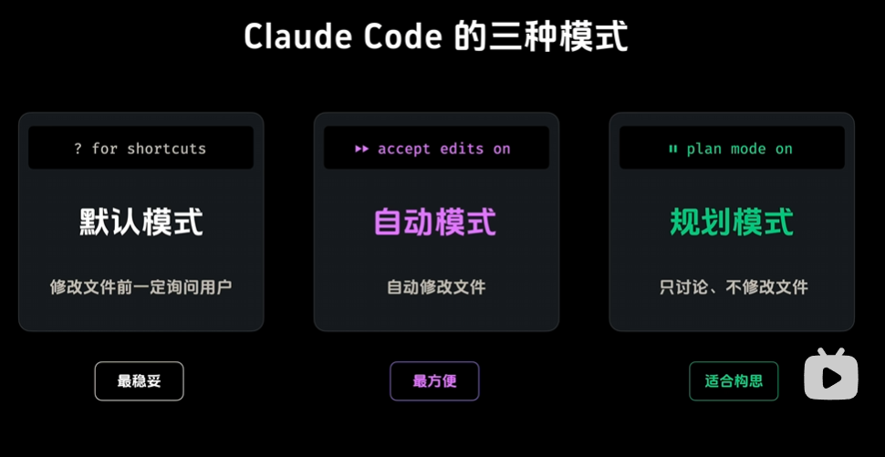
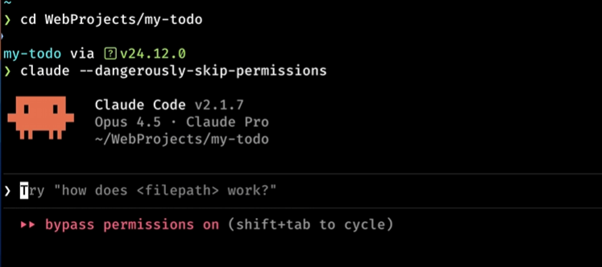

# Claude Code 使用说明

## 基础操作

### Shift + Tab 切换模式



### 给claude code最大的权限



### /tasks 查看后台任务

### /rewind 进行任务回滚（或者按两下esc）

### claude -c 打开claude并自动恢复到上次对话

### /compact 进行上下文压缩（ctrl + O 可以看到压缩后的上下文，再按ctrl + O 返回）

### /clear 清空所有的上下文

### /init 自动生成一个CLAUDE.md文件

### /memory 进行项目内存编辑

## 虚拟环境使用

### 无需激活虚拟环境即可使用 Claude Code

**重要提示：** 你可以直接进入项目目录使用 Claude Code，无需先激活虚拟环境！

#### 当前项目配置

- **虚拟环境路径**: `.venv/`
- **Python 版本**: 3.13.0
- **Python 可执行文件**: `.venv/Scripts/python.exe` (Windows)

#### 推荐工作流程

```bash
# 1. 直接进入项目目录
cd D:\codes\study\python

# 2. 启动 Claude Code（无需激活虚拟环境）
claude

# 3. Claude Code 会自动使用虚拟环境中的 Python
```

#### Claude Code 如何使用虚拟环境

Claude Code 会通过以下方式自动使用你的虚拟环境：

**方法 1：使用完整路径**

```bash
.venv/Scripts/python.exe -m pip install requests
.venv/Scripts/python.exe main.py
```

**方法 2：临时激活（如果需要）**

```bash
.venv/Scripts/activate && python main.py
```

#### 常用命令示例

```bash
# 安装包
.venv/Scripts/python.exe -m pip install <package>

# 查看已安装的包
.venv/Scripts/python.exe -m pip list

# 运行脚本
.venv/Scripts/python.exe main.py

# 运行 FastAPI 应用
.venv/Scripts/python.exe -m uvicorn main:app --reload
```

#### 为什么不需要激活？

- Claude Code 可以直接调用虚拟环境中的 Python 解释器
- 所有依赖包都会从 `.venv/` 中加载
- 避免了手动激活/停用的繁琐步骤
- 更适合自动化和脚本执行

## 配置文件说明

### `.claude/` 配置文件 vs CLAUDE.md

Claude Code 使用两种不同的配置机制，它们各司其职、相互配合：

#### 一、`.claude/` 配置文件

**性质：** 系统配置文件（JSON 格式）

**作用：** 控制 Claude Code 的**行为和权限**

**配置文件层级：**

1. **全局设置** (`~/.config/claude/settings.json`): 适用于所有项目
2. **项目设置** (`.claude/settings.json`): 项目级设置，通常提交到 git
3. **本地设置** (`.claude/settings.local.json`): 本地覆盖设置，不提交到 git

**常见配置内容：**

- 权限设置（允许/禁止哪些操作）
- MCP 服务器配置
- 自定义技能/命令
- 钩子（hooks）配置
- 模型偏好设置

**示例配置：**

```json
{
  "permissions": {
    "allow": ["Bash(python:*)"],
    "deny": ["Bash(rm:*)"]
  },
  "mcpServers": {
    "myserver": {
      "command": "node",
      "args": ["server.js"]
    }
  }
}
```

#### 二、CLAUDE.md 文件

**性质：** 项目文档文件（Markdown 格式）

**作用：** 为 Claude 提供**项目上下文和知识**

**应包含内容：**

1. **项目概述** - 项目功能、技术栈、架构
2. **代码库结构** - 目录组织、关键文件
3. **开发指南** - 编码规范、测试实践
4. **重要上下文** - 设计决策、已知问题
5. **常见任务** - 运行、测试、部署流程

**示例内容：**

```markdown
# 项目说明

这是一个 FastAPI 项目...

## 目录结构

- `my_fastApi/`: 主应用目录
- `main.py`: 应用入口

## 编码规范

- 使用 Python 3.10+
- 遵循 PEP 8 规范
```

#### 三、区别与联系

**形象比喻：**

- **`.claude/` 配置** = Claude Code 的"操作手册"（告诉它能做什么、怎么做）
- **CLAUDE.md** = 你项目的"说明书"（告诉它你的项目是什么、如何理解）

**对比表格：**

| 方面         | `.claude/` 配置                                | CLAUDE.md              |
| ------------ | ---------------------------------------------- | ---------------------- |
| **控制行为** | ✅ 控制能执行什么操作                          | ❌ 不控制行为          |
| **提供知识** | ❌ 不提供项目知识                              | ✅ 提供项目上下文      |
| **格式**     | JSON（机器可读）                               | Markdown（人类可读）   |
| **读取时机** | 每次工具调用时检查                             | 对话开始时读取         |
| **影响范围** | 技术层面（权限、工具）                         | 认知层面（理解、决策） |
| **版本控制** | settings.json 提交，settings.local.json 不提交 | 通常提交到 git         |

**配合使用示例：**

1. **允许 Python 命令执行**
   - `.claude/settings.local.json`: 配置 `"allow": ["Bash(python:*)"]`
   - CLAUDE.md: 说明"本项目使用 Python 3.10，虚拟环境在 venv/ 目录"

2. **代码风格控制**
   - `.claude/` 配置: 配置 hooks 在提交前运行 linter
   - CLAUDE.md: 描述"我们使用 Black 格式化，行长度 88 字符"

3. **数据库操作**
   - `.claude/` 配置: 设置权限允许读取 `.env` 文件
   - CLAUDE.md: 说明"数据库配置在 .env 中，使用 SQLAlchemy ORM"

**总结：**

- **`.claude/` 配置** 告诉 Claude Code **"你能做什么"**（权限和能力）
- **CLAUDE.md** 告诉 Claude Code **"你应该知道什么"**（项目知识和上下文）

两者结合使用，让 Claude Code 既有正确的权限执行操作，又有足够的上下文做出明智的决策。
