# FastAPI 简介

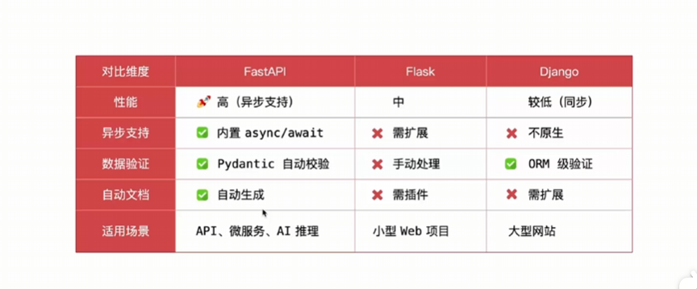
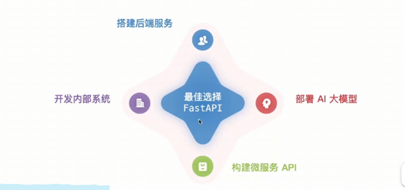
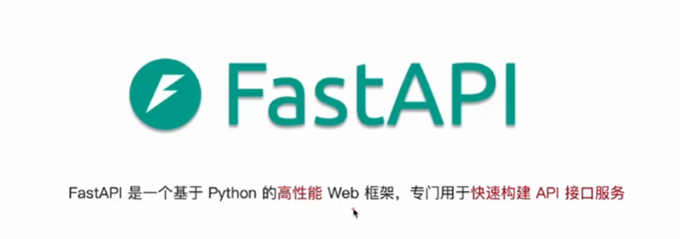
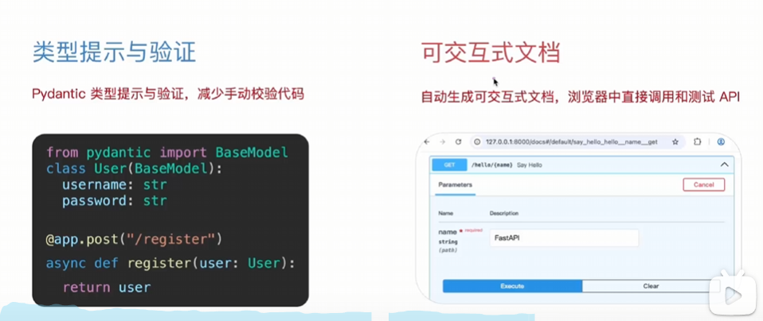


## 开发环境与启动要点

- 建议在项目根目录创建虚拟环境：`python -m venv .venv`，与宿主机（本机操作系统）的全局 Python 隔离
- 在 VS Code 里选择解释器（Select Interpreter），确保运行/调试/安装依赖都使用 `.venv` 的 Python
- 终端出现 `(.venv)` 表示已激活，可直接 `pip install ...`；未激活时可用 `.venv\Scripts\pip`
- 退出/进入虚拟环境：`deactivate`；重新进入（PowerShell）`\.\.venv\Scripts\Activate.ps1`
- Docker 容器本身隔离依赖，容器内一般不需要再建虚拟环境；但本地开发仍建议用 `.venv`
- `requirements.txt` 用 `pip freeze > requirements.txt` 固化依赖；`.gitignore` 加 `.venv/` 避免提交，安装（根据文件重建环境）：
'pip install -r requirements.txt'

## 启动 FastAPI

- `uvicorn main:app --reload --port 8001`：使用 Uvicorn 启动应用，`main:app` 指 `main.py` 里的 `app`
- `--reload` 仅用于开发，代码变更会自动重启
- 端口冲突时改端口（如 8001、8002）即可多开
- 报错找不到模块时，确认在项目目录运行，或用模块路径：`uvicorn my_fastApi.main:app --reload --port 8001`

## ASGI 概念

- ASGI（异步服务器网关接口）是服务器与应用之间的协议标准
- Uvicorn 是 ASGI 服务器，负责接收请求并交给 FastAPI 处理

## VS Code 创建 FastAPI 项目（虚拟环境隔离）

- 打开一个新文件夹作为项目根目录（如 `D:\codes\study\python\my_fastApi`）
- 在根目录创建虚拟环境：`python -m venv .venv`
- VS Code 选择解释器：`Ctrl+Shift+P` → `Python: Select Interpreter` → 选 `.venv\Scripts\python.exe`
- 安装依赖（激活后）：`pip install fastapi uvicorn`
- 创建入口文件 `main.py`，并用 `uvicorn main:app --reload --port 8001` 启动
- 依赖只安装在 `.venv` 中，不会污染全局 Python 环境

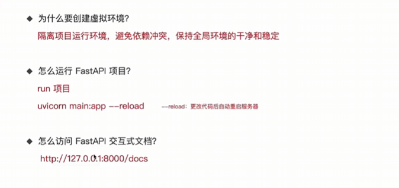

## 重新打开 VS Code 后进入虚拟环境

- 进入虚拟环境只影响当前终端：`\.\.venv\Scripts\Activate.ps1`（PowerShell），提示符出现 `(.venv)` 即生效
- VS Code 的运行/调试/提示依赖所选解释器，可能仍是全局 Python
- 建议第一次用 `Ctrl+Shift+P` → `Python: Select Interpreter` 选择 `.venv\Scripts\python.exe`，之后会自动记住

# 路由

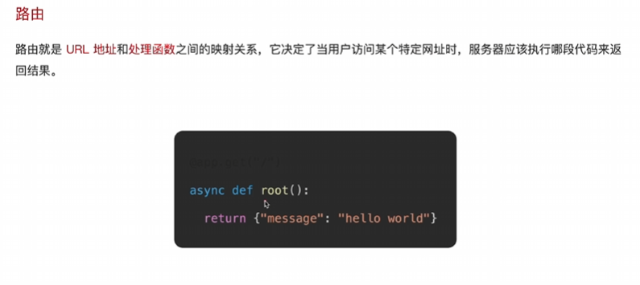
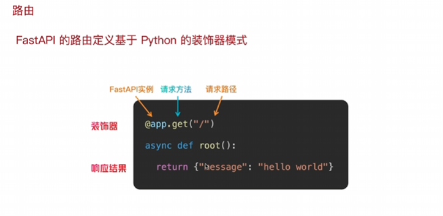
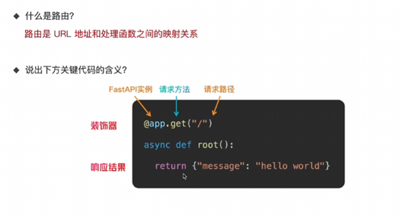

## 路由组织方式

- 路由不必都写在 `main.py`，更推荐拆分到多个模块
- `@app.get(...)` 直接注册到 `app`
- `@router.get(...)` 先注册到 `router`，再用 `app.include_router(router)` 挂载到应用
- 常见做法：各模块用 `APIRouter` 定义路由，`main.py` 统一 include

## 路由示例

`routers/users.py`：

```python
from fastapi import APIRouter

router = APIRouter()

@router.get("/users")
def list_users():
    return []
```

`main.py`：

```python
from fastapi import FastAPI
from routers import users

app = FastAPI()
app.include_router(users.router)
```

# 参数

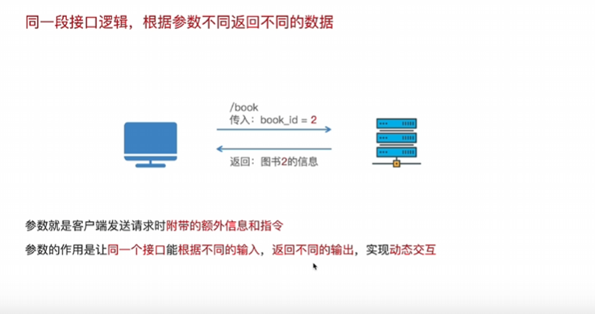
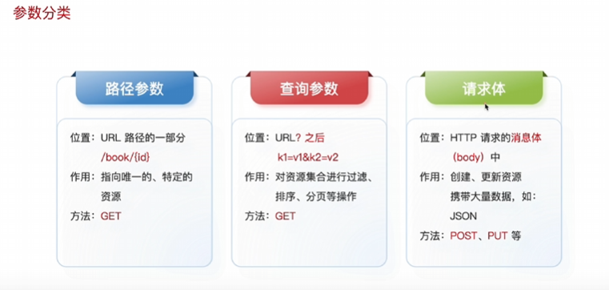

## 路径参数

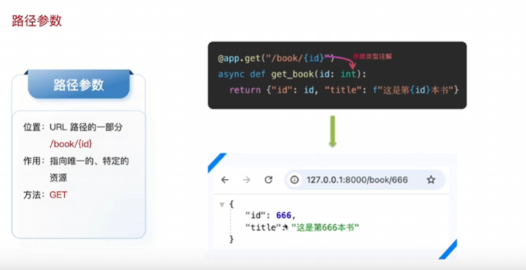

## 路径参数-Path类型注解


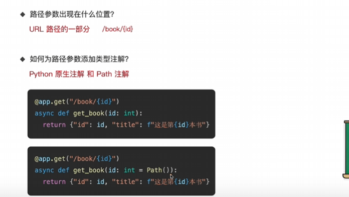

## Path 参数示例

- `Path` 用于对路径参数进行校验和描述（如范围、标题、示例）
- 示例：`/items/{item_id}`，要求 `item_id >= 1`

```python
@app.get("/items/{item_id}")
async def get_item(
    item_id: int = Path(
        ...,
        title="Item ID",
        description="Item identifier, must be >= 1",
        ge=1,
        example=100,
    )
):
    return {"item_id": item_id}
```

## 查询参数

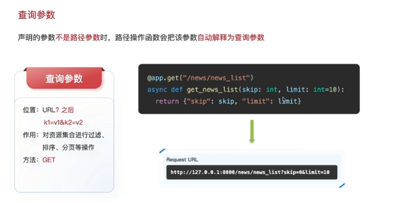
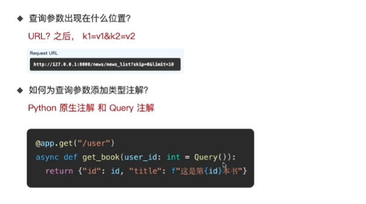

## Query 参数示例

- `Query` 用于定义查询参数（URL 里的 `?key=value`），并进行校验与描述
- 示例：`/search?q=fastapi&page=1&size=10`

```python
@app.get("/search")
async def search_items(
    q: str = Query(..., min_length=1, max_length=50, description="Search keyword"),
    page: int = Query(1, ge=1, description="Page number"),
    size: int = Query(10, ge=1, le=100, description="Page size"),
):
    return {"q": q, "page": page, "size": size}
```

## 请求体参数

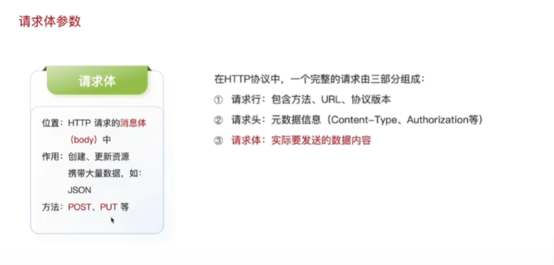
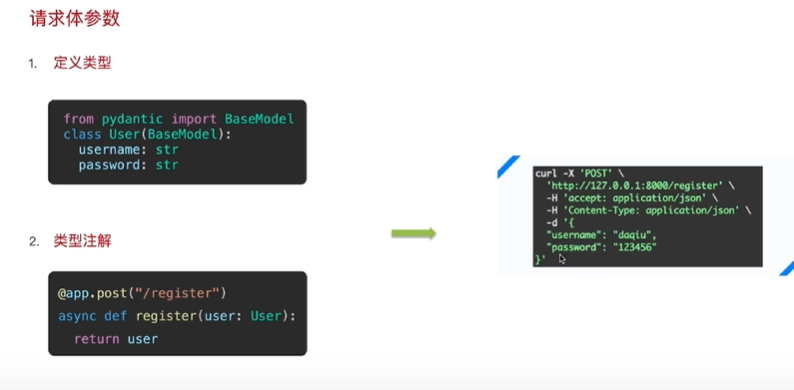

## 请求体参数，Field类型注解

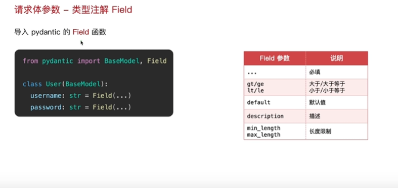
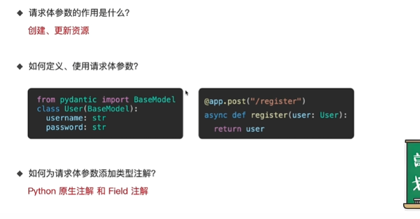

# 响应类型

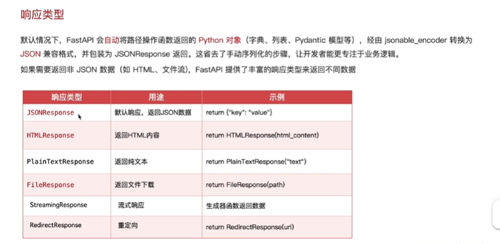
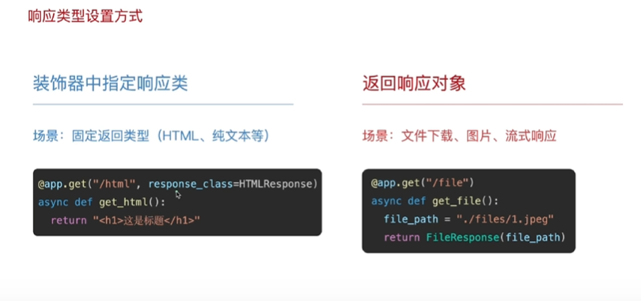
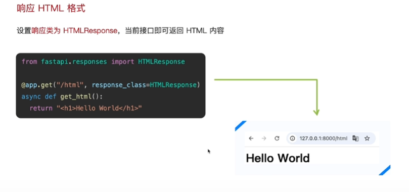
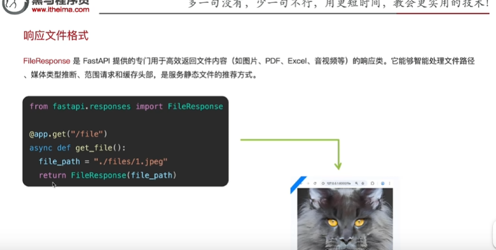
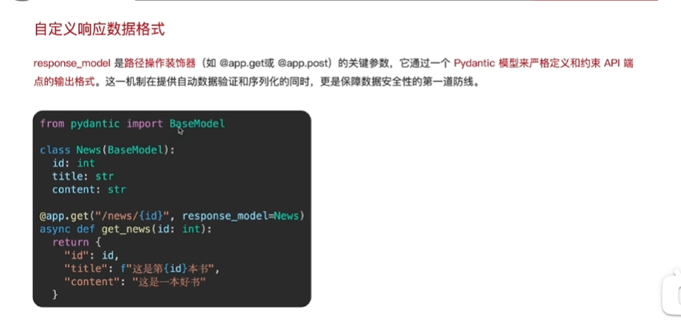
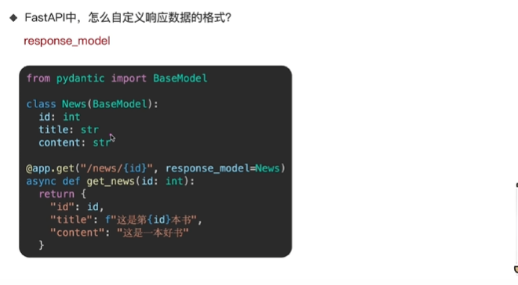
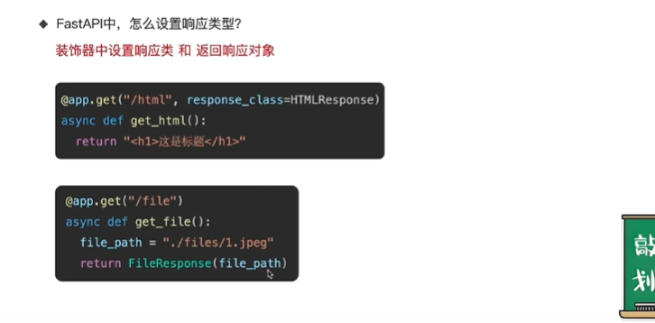

# 异常处理

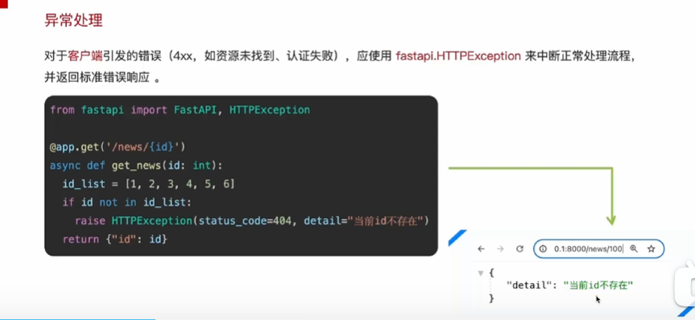
